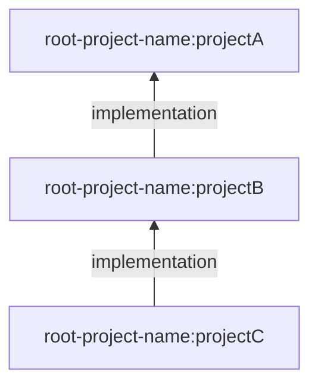

# Gradle Project Dependents Plugin

[](https://plugins.gradle.org/plugin/io.github.bjoernmayer.gradle-project-dependents)

Gradle Plugin to list project dependents of a project in multi-projects.

## Usage

Using the https://docs.gradle.org/current/userguide/plugins.html#sec:plugins_block:

```kts
plugins {
    id("io.github.bjoernmayer.gradle-project-dependents") version "<version>"
}
```

Using legacy plugin application:

```kts
buildscript {
    repositories {
        maven {
            url = uri("https://plugins.gradle.org/m2/")
        }
    }
    dependencies {
        classpath("io.github.bjoernmayer:plugin:<version>")
    }
}

apply(plugin = "io.github.bjoernmayer.gradle-project-dependents")
```

## Tasks

### `dependents`

Displays a tree of dependent projects on the project, where the task was executed in.

#### Example:

Imagine a multi-project with Project A, Project B, Project C

Project B `build.gradle.kts`:

```
dependencies {
    implementation(project(":projectA"))
}
```

Project C `build.gradle.kts`:

```
dependencies {
    implementation(project(":projectA"))
    implementation(project(":projectC"))
}
```

Executing the task:

```bash
./gradlew :projectA:dependents
```

Expected output:

```bash
+--- project root-project-name:projectA
|    +--- project root-project-name:projectB (implementation)
|    |    \--- project root-project-name:projectC (implementation)
|    \--- project root-project-name:projectC (implementation)
```

## Configuration

### `excludedConfigurations`

Configurations can be excluded from the printed graph by adding them to `excludedConfigurations`:

```kts
// build.gradle.kts

projectDependents {
    excludedConfigurations.add("testImplementation")
}
```

### `depth`

Limit the depth of the dependency tree to display. When not set, the full tree is displayed.

```kts
// build.gradle.kts

projectDependents {
    // Show only direct dependents
    depth.set(1)

    // Or show dependents and their dependents
    depth.set(2)
}
```

### `outputFormats`

Configure which output formats to generate. Available formats:

| Format    | Description                      | Output                               |
| --------- | -------------------------------- | ------------------------------------ |
| `STDOUT`  | Tree format printed to console   | Console output                       |
| `YAML`    | YAML representation of the graph | `build/projectDependents/graph.yaml` |
| `JSON`    | JSON representation of the graph | `build/projectDependents/graph.json` |
| `MERMAID` | Mermaid flowchart in Markdown    | `build/projectDependents/graph.md`   |

Default is `STDOUT` only.

```kts
// build.gradle.kts
import io.github.bjoernmayer.gradleProjectDependents.OutputFormat

projectDependents {
    // Use only YAML output (replaces default STDOUT)
    outputFormats.set(setOf(OutputFormat.YAML))

    // Or use multiple formats
    outputFormats.set(setOf(OutputFormat.STDOUT, OutputFormat.JSON, OutputFormat.MERMAID))
}
```

#### STDOUT Output Example

```
+--- project root-project-name:projectA
|    +--- project root-project-name:projectB (implementation)
|    |    \--- project root-project-name:projectC (implementation)
|    \--- project root-project-name:projectC (implementation)
```

#### JSON Output Example

```json
{
  "name": "root-project-name:projectA",
  "dependents": {
    "implementation": [
      {
        "name": "root-project-name:projectB",
        "dependents": {
          "implementation": [
            {
              "name": "root-project-name:projectC",
              "dependents": {}
            }
          ]
        }
      }
    ]
  }
}
```

#### Mermaid Output Example

The Mermaid output generates a flowchart that can be rendered in GitHub, GitLab, or any Mermaid-compatible viewer:



## Developing

Checkout this repository next to some project, where you want to use it.
Then in the `settings.gradle.kts` of said project, add this:

```kts
// settings.gradle.kts

pluginManagement {
    includeBuild("../gradle-project-dependents")
}
```

Then, you can just apply the plugin like usual:

```kts
// build.gradle.kts

id("io.github.bjoernmayer.gradle-project-dependents")
```
